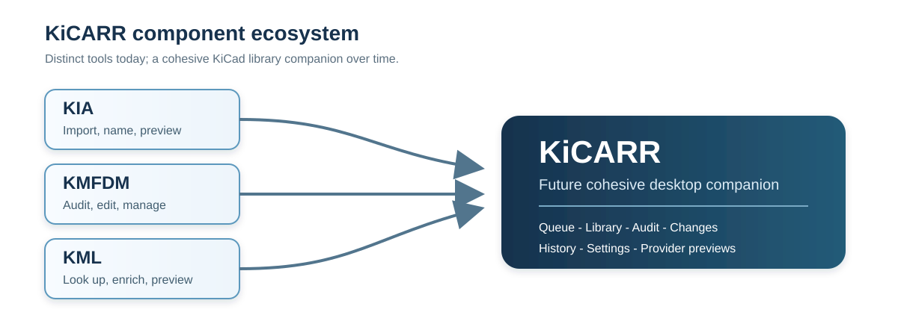

# Chris McCreary

### Hardware development, electrical test, rapid prototyping, and systems integration

I am an electrical test engineer and retired Navy Chief with more than 20 years of hands-on work across RF communications, electronics repair, embedded systems, test engineering, rapid prototyping, and technical leadership.

My work tends to live at the boundaries between disciplines: turning an uncertain test need into a fixture, an enclosure, a PCB, a data-collection system, a cable interface, or a maintainable piece of hardware that a team can actually use.

  
  

## What I work on

- **PCB and electronics development:** KiCad and Altium design support, footprints and library organization, microcontroller boards, driver boards, RF antenna experiments, Gerber review, board bring-up, soldering, rework, and practical manufacturability feedback.
- **Test systems and troubleshooting:** DAQ interfaces, signal conditioning, current and voltage monitoring, RF test support, environmental and EMI preparation, fault isolation, fixtures, procedures, and maintainability-focused improvements.
- **Embedded systems and data collection:** ESP8266/ESP32, RP2040/Pico, Raspberry Pi, C/C++, sensors, MQTT, Node-RED, time synchronization, remote diagnostics, and field-friendly configuration.
- **Mechanical design and fabrication:** Fusion 360, SolidWorks, CNC and 3D-printed parts, enclosures, mounts, molds, ruggedized housings, cable and harness interfaces, and electromechanical test hardware.
- **Systems integration:** translating between electrical, mechanical, software, test, production, and operator concerns while balancing schedule, cost, reliability, and repairability.

## Selected public projects

| Project | What it demonstrates |
| --- | --- |
| [Pan-Tilt Platform](https://github.com/Phoenixjack/Pan-Tilt-Platform) | A browser-controlled ESP8266 pan/tilt test fixture combining CAD, embedded control, motor hardware, and repeatable positioning. The mechanical design is also available on [GrabCAD](https://grabcad.com/library/pan-tilt-platform-2). |
| [Vehicle Lighting Add-on](https://github.com/Phoenixjack/vehicle-lighting-addon) | A functional ESP8266 prototype using accelerometer input, filtering, configurable thresholds, ambient-light scaling, and a driven auxiliary-light output. |
| [I2C Debug Tool](https://github.com/Phoenixjack/i2c-debug-tool) | A practical Arduino serial shell for scanning, identifying, reading, dumping, and writing I2C devices during hardware bring-up. |
| [KiCad Import Assistant](https://github.com/Phoenixjack/kicad-import-assistant) | A preview-first workflow for safely importing vendor footprints, symbols, and 3D models into controlled KiCad libraries. |
| [KMFDM](https://github.com/Phoenixjack/kmfdm) | A desktop-oriented KiCad metadata auditor and bulk editor focused on library consistency, policies, review, and safe changes. |
| [KiCad Metadata Lookup](https://github.com/Phoenixjack/kicad-metadata-lookup) | An experimental provider-lookup tool that keeps user API keys local while exploring metadata enrichment workflows. |

## KiCARR: the longer-term KiCad toolset

[KiCARR](https://github.com/Phoenixjack/KiCARR) is the planned umbrella for a cohesive KiCad library companion. Its component projects are deliberately recognizable today because each explores a different part of the eventual workflow:

- **KIA** handles cautious intake, naming, preview, and import planning.
- **KMFDM** handles scanning, metadata editing, policies, audit findings, changes, and history.
- **KML** explores provider-backed metadata lookup and preview.
- **KiCARR** is intended to bring those lessons together in a shared desktop product over time.

KiCARR itself is still in the planning/bootstrap stage. The component repositories are useful references and experiments, not a claim that the integrated product is finished.

## Working approach

I favor practical tools and prototypes that make risk visible early:

1. understand the real operating constraint;
2. build the smallest useful fixture, board, interface, or proof of concept;
3. collect evidence through bench or field testing;
4. document weak points and tradeoffs;
5. refine for repeatability, maintainability, and handoff.

## Elsewhere

- [GitHub profile](https://github.com/Phoenixjack)
- [LinkedIn](https://www.linkedin.com/in/chris-mccreary-9aa9b7138/)
- [Pan-Tilt Platform on GrabCAD](https://grabcad.com/library/pan-tilt-platform-2)
- [Portfolio site](https://phoenixjack.github.io/)

A full public resume is available at [phoenixjack.github.io/resume/](https://phoenixjack.github.io/resume/).
